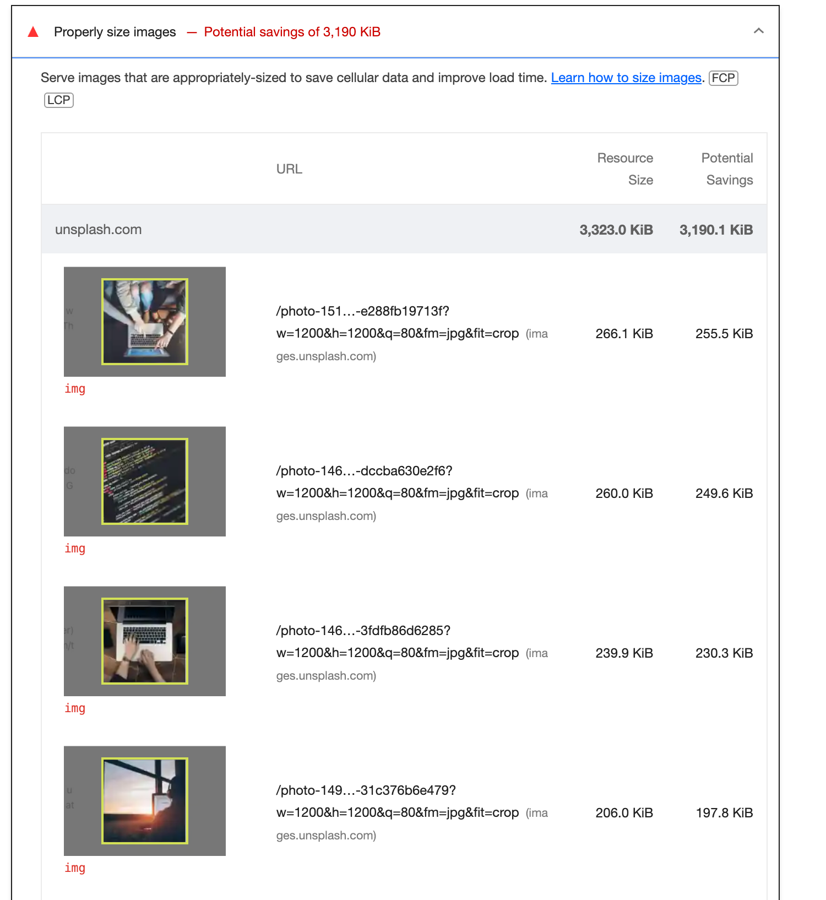
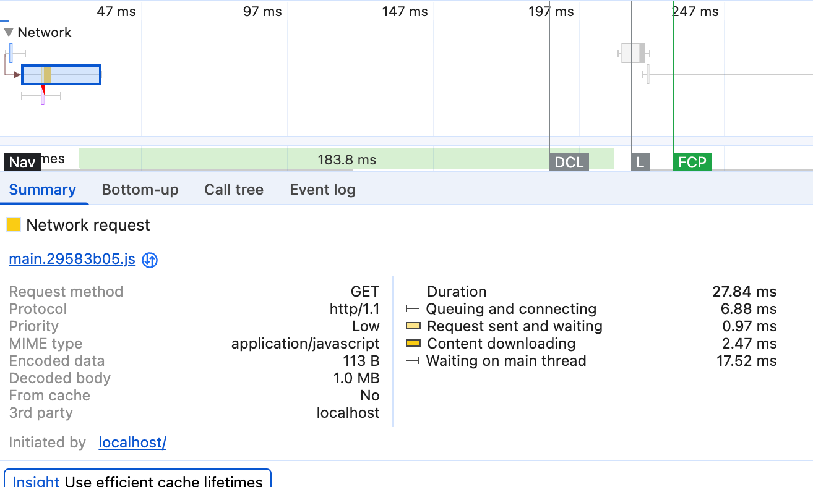
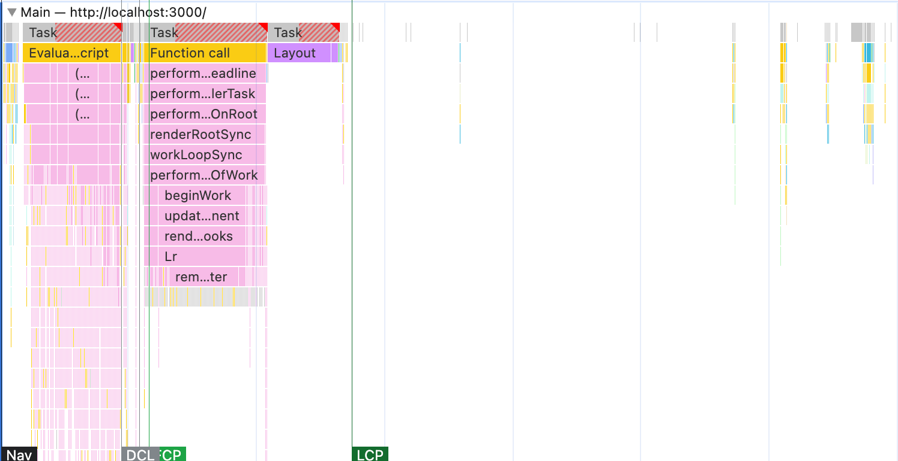
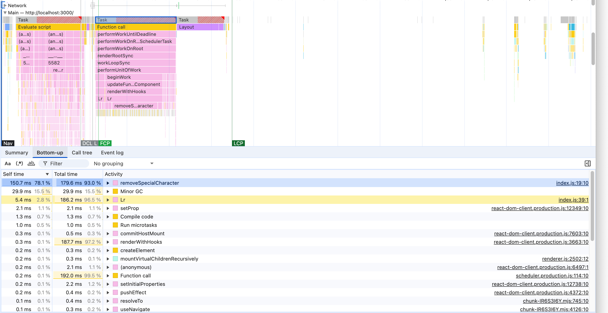
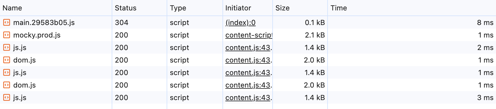

# Performance Lecture 1 - Lighthouse로 시작하는 웹 최적화

## 개요

### 최적화 기법

#### 이미지 사이즈 최적화

- 너무 큰 사이즈의 이미지는 네트워크 트래픽이 증가해 서비스 로딩이 오래걸림
- 너무 작은 사이즈의 이미지는 화질이 저하되어 서비스 이용이 불편해짐

#### 코드 분할

- 첫페이지 진입 시 당장 사용하지 않는 코드는 코드분할을 통해 따로 로드

#### 텍스트 압축

- HTML, CSS, JS 등을 다운로드 전에 서버에서 미리 압축

#### 병목 코드 최적화

- 너무 느리게 다운로드 되거나 느리게 실행되는 특정 자바스크립트 코드를 찾아 최적화

### 최적화 툴

- 크롬 개발자 도구 Network 패널
- Performance 패널
- Lighthouse 패널
- webpack-bundle-analyzer

# Lighthouse 이용한 페이지 검사 및 개선

모든 최적화 포인트를 외우고 있으면 좋겠지만 현실적으로 불가능하므로 Lighthouse의 도움을 받는다. 검사 지표를 보고 Lighthouse가 제공한 Opportunity와 Diagnotics를 적용한다.

### 개선 이전 검사결과


## Web Vitals

### FCP (First Contentful Paint)

- DOM 컨텐츠의 첫번째 부분을 렌더링 하는데 걸리는 시간

### SI (Speed Index)

- 페이지의 점진적 완성 과정의 속도
- 시간에 따른 시각적 완성도 곡선 아래의 면적을 계산

### LCP (Largest Contentful Paint)

- 페이지 내 가장 큰 이미지나 텍스트 요소가 렌더링되기까지 걸리는 시간

### TTI (Time To Interactive)

- 사용자가 페이지와 상호 작용이 가능한 시점까지 걸리는 시간

### TBT (Total Blocking Time)

- 페이지가 사용자 입력에 응답하지 않도록 차단된 시간을 총합한 지표
- FCP, TTI 사이의 시간동안 발생

### CLS (Cumulative Layout Shift)

- 페이지 로드과정에서 발생한 예기치 못한 레이아웃 이동

## 이미지 사이즈 최적화

### 비효율적인 이미지 분석

- Diagnotics 항목을 보면 비효율적인 이미지가 로드되는 상황이 나타남
  
- 적절한 이미지 크기를 보기위해 해당 이미지가 로드되는 Element를 확인
  
- 레티나 디스플레이의 상황을 고려하여 120*120을 딱 맞출것이 아니라 가로세로 2배정도 더 큰 이미지를 로드 (240*240)

## 병목 코드 최적화

### Performance 패널 분석

1. Performance 패널에서 메인스레드의 작업을 상세하게 살펴보고 느린 작업이 무엇인지 확인
2. "Start profiling and reload page" 버튼 클릭

### CPU 차트

어느 타이밍에 어떤작업이 진행되는지 알 수 있음


- 노란색: 자바스크립트 실행
- 보라색: 렌더링/레이아웃
- 초록색: 페인팅
- 회색: 기타
- 빨간색: 병목지점 (특정 작업이 메인 스레드를 오랫동안 잡고 있을때)

### Network 타임라인



- 서비스 로드 과정에서 네트워크 요청을 시간 순서에 따라 보여줌
- 오래걸리는 작업은 클릭하여 선택후 하단 탭의 summary를 통해 문제 파악 가능
- (JS 파일의 크기: 1.0MB)

### 플레임 차트

어떤 작업이 오래 걸리는지 파악 가능


### 하단 탭

- **Summary**: 선택 영역에서 발생한 작업 시간의 총합과 각 작업이 차지하는 비중
- **Bottom up**: 가장 최하위에 있는 작업부터 상위 작업까지 보여줌
- **Call Tree**: 가장 상위에 있는 작업부터 하위 작업 순으로 보여줌
- **Event Log**: 브라우저 이벤트 (Loading, Experience Scripting, Rendering, Paint)

### 분석 방법

1. 병목이 걸리는 Task를 선택
2. 하단 탭의 Bottom up 섹션을 통해 어떤 작업의 Self time이 가장 큰지 확인
3. 이 경우 `removeSpecialCharacter`의 작업이 병목을 유발



```javascript
function removeSpecialCharacter(str) {
  const removeCharacters = [
    '#',
    '_',
    '*',
    '~',
    '&',
    ';',
    '!',
    '[',
    ']',
    '`',
    '>',
    '\\n',
    '=',
    '-',
  ]
  let _str = str
  let i = 0,
    j = 0
  for (i = 0; i < removeCharacters.length; i++) {
    j = 0
    while (j < _str.length) {
      if (_str[j] === removeCharacters[i]) {
        _str = _str.substring(0, j).concat(_str.substring(j + 1))
        continue
      }
      j++
    }
  }
  return _str
}
```

실제로 보면 replace 함수를 사용하면 될것을 for 루프를 돌고 있음.

## 코드 분할

### 분할 기준

1. Network 타임라인을 통해 유난히 크고 다운로드가 오래걸리는 자바스크립트 파일 확인
2. webpack-bundle-analyzer를 통해 해당 자바스크립트 파일이 어떤 코드로 이루어져 있는지 확인
   
3. refractor 패키지의 용량이 너무 큼. 직접 설치한 패키지가 아니라면 lock.json파일을 확인하여 어느 패키지가 의존성을 가지고 있는지 확인 -> react-syntax-highlighter
4. react-syntax-highlighter 패키지는 Code Block 컴포넌트에서만 사용되니 굳이 처음 진입시 로드할 필요는 없음. 따라서 lazy load
   

### 결과확인


#### Page별 분할

- 기존 Route설정파일에서 일반 import (List->Detail 페이지로 이동)
  
- Page별 lazy import (List->Detail 페이지로 이동)
  

#### 차이점

- List 페이지 진입 시 진입 속도가 빨라짐 (8ms->2ms)
- Detail 페이지 진입 시 또다시 js 파일을 로드하게 됨 (분할을 했기 때문에)

## 텍스트 압축

서버에서 gzip으로 압축해보내자!
