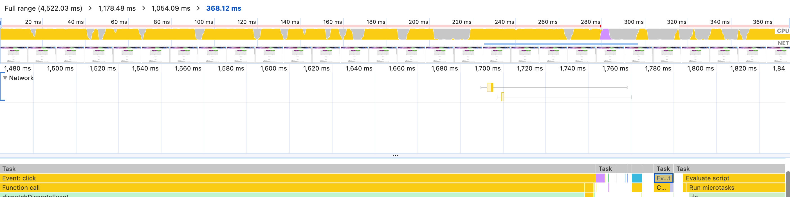

# Performance Lecture 2 - 애니메이션부터 이미지 로딩까지

## 최적화 기법

- **CSS 애니메이션 최적화**
- **컴포넌트 지연 로딩**
  - 이전에는 페이지를 분할했지만 이제는 단일 컴포넌트를 분할하여 컴포넌트가 쓰이는 순간에 로드
- **컴포넌트 사전 로딩**
  - 분할된 코드를 preload하여 필요한 시점보다 먼저 다운로드.
- **이미지 사전로딩**
  - 이미지를 필요한 시점보다 먼저 다운로드하고 필요할때 로드

## 최적화 툴

- **크롬 개발자 도구**
  - Network 패널
  - Performance 패널
- **webpack-bundle-analyzer**

## 최적화

### 애니메이션 최적화

#### Jank 현상

웹페이지나 앱에서 발생하는 시각적 끊김 현상. 브라우저가 정상적으로 60FPS로 화면을 그리지 못하기때문에 발생. Jank 현상은 주로 reflow, repaint로 인해 발생함.

- **reflow**: 요소의 크기나 위치가 변경되어 레이아웃을 다시 계산하는 과정. width, height, margin, padding, position 변경 시 발생
- **repaint**: 요소의 시각적 스타일만 변경되어 다시 그리는 과정. color, background-color, visibility, outline 변경 시 발생.

#### Jank 현상을 피하는 방법

transform, opacity, will-change 같은 속성을 사용. 해당 Element를 벌도의 레이어로 분리하고 작업을 GPU에 위임함으로써 레이아웃 단계와 페인트 단계를 건너뜀. (=하드웨어 가속)

#### 하드웨어 가속

현재 width 로 애니메이션을 조절하다보니 리플로우 작업(layout 시작~paint끝)이 1frame(1/60초)동안 끝나질 않는다.


이를 transform으로 변환해보면 결과는 다음과 같다.


### 컴포넌트 지연 로딩

서비스 첫화면부터 필요하지 않는 컴포넌트의 경우 지연로딩을 통해 chunk를 분리해준다. 여기서는 import한 Modal 컴포넌트의 경우 코드 분할해준다.

※ 컴포넌트를 lazy load 할때에는 suspense를 감싸주자.

```javascript
function App() {
  const [showModal, setShowModal] = useState(false)
  const [ImageModal, setImageModal] = useState(null);

  useEffect(() => {
    import('./components/ImageModal').then(res=> {
      // res.default는 함수형이기 때문에 setState 함수가 state 업데이트 함수로 오해함
      setImageModal(() => res.default)
    })
  }, []);

  return (


      <ButtonModal onClick={() => {
        setShowModal(true)
      }}>올림픽 사진 보기


      {showModal ? <ImageModal closeModal={() => {
        setShowModal(false)
      }} /> : null}

  )
}
```

### 컴포넌트 사전 로딩

모달을 지연로딩시키면 모달을 열었을때 네트워크를 통해 모달 코드를 새로 로드해야했다. 그러니 당연하게도 다음과 같이 모달이 뜨기전까지 지연이 발생한다.(click event ~ evaluate script)



이러한 지연을 해결하기 위해 렌더링이 완료된 직후 여유가 있을때 Modal 컴포넌트를 가져온다.


### 이미지 사전 로딩

모달을 열때 이미지가 제때 뜨지 않는다. 이로인해 CLS 이슈가 발생한다.


Modal을 로드할때 Modal 내 필요한 이미지들을 모두 로드한다.

```javascript
function App() {
  const [showModal, setShowModal] = useState(false)
  const [ImageModal, setImageModal] = useState(null);

  useEffect(() => {
    import('./components/ImageModal').then(res=> {
      // res.default는 함수형이기 때문에 setState 함수가 state 업데이트 함수로 오해함
      setImageModal(() => res.default)
      images.forEach(image=> {
        const img = new Image()
        img.src = image.original
      })
    })
  }, []);

  return (


      <ButtonModal onClick={() => {
        setShowModal(true)
      }}>올림픽 사진 보기


      {showModal ? <ImageModal closeModal={() => {
        setShowModal(false)
      }} /> : null}

  )
}
```
