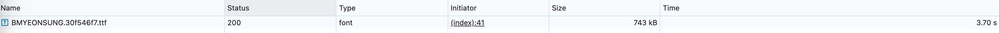

# Performance Lecture 3 - 이미지, 폰트, CSS 최적화 완벽 가이드

## 개요

## 최적화 기법

- **이미지 지연 로딩**: 첫화면에 당장 필요하지 않은 이미지가 로드 되지않도록 지연
- **이미지 사이즈 최적화**: 이전에는 CDN에서 로드된 이미지의 크기를 수정했지만 이번에는 정적 이미지를 최적화
- **폰트 최적화**: 커스텀 폰트 최적화
- **캐시 최적화**: 불필요한 CSS 제거
- **불필요한 CSS 제거**: 불필요한 CSS 코드를 제거하여 파일사이즈 줄이기

## 최적화 툴

- **크롬 개발자 도구**
  - Coverage 패널: 웹페이지를 렌더링하는 과정에서 어떤 코드가 실행되었는지, 얼마나 실행되었는지(비율) 확인.
- **Squoosh**: 이미지 압축 도구
- **PurgeCSS**: 사용하지 않는 CSS 제거

## 최적화

### 이미지 지연로딩

이미지 영역이 화면에 보이는 순간 또는 그 직전에 이미지를 로드.

#### Scroll Event 감지 방식

scroll이 이동할때마다 콜백함수가 실행되기 때문에 내부에 무거운 로직이 들어가면 브라우저 메인스레드에 부담이감.

#### IntersectionObserver 방식

스크롤 할때마다 콜백함수가 실행되는 것이 아님.

```javascript
function Card(props) {
  const img = useRef(null)
  useEffect(() => {
    const intersectionObserver = new IntersectionObserver(
      e => {
        if (e[0].isIntersecting) {
          console.log(e[0].target)
          const imgComponent = img.current.querySelector('img')
          imgComponent.src = imgComponent.dataset.src
          intersectionObserver.unobserve(e[0].target)
        }
      },
      {
        root: document,
        rootMargin: '0px',
        threshold: 1,
      }
    )
    intersectionObserver.observe(img.current)
    return () => intersectionObserver.disconnect()
  }, [])

  return (
    <div ref={img} className='Card text-center'>
      
      <div className='p-5 font-semibold text-gray-700 text-xl md:text-lg lg:text-xl keep-all'>
        {props.children}
      </div>
    </div>
  )
}
```

※ img 컴포넌트에 대한 display:none->display:block 의 변경으로 위 문제를 해결 할 수 없다. 무조건 src를 넣는 시점을 제어해야한다.

Card 내 이미지의 크기가 커 로딩속도가 너무 느리다.

**사이즈**: PNG > JPG > WebP  
**화질**: PNG = WebP > JPG  
**호환성**: PNG = JPG > WebP

JPG/PNG 포맷의 이미지를 WebP 포맷으로 변환하여 고화질, 저용량 이미지로 최적화.

WebP를 지원하지 못하는 브라우저의 경우 JPG/PNG로 로드하게 해줘야한다. 이를 대비하기 위해 `<picture>` 를 이용한다.

(https://www.w3schools.com/tags/tryit.asp?filename=tryhtml5_picture)

```html
# 뷰포트 크기에 따라 구분
<picture>
  <source media="(min-width:650px)" srcset="img_pink_flowers.jpg" />
  <source media="(min-width:450px)" srcset="img_white_flowers.jpg" />
  
</picture>

# 이미지 포맷에 따라 구분
<picture>
  <source type="image/avif" srcset="img_pink_flowers.avif" />
  <source type="image/webp" srcset="img_pink_flowers.webp" />
  
</picture>
```

### 동영상 최적화

동영상 압축 웹 사이트에서 동영상 너비, 높이, Bitrate, Audio 유무 등을 조정하여 메모리 최적화.

단, 화질이 저화 되므로 영상이 중요하지 않다면 이를 보완하기위해 CSS 상으로 blur등의 필터를 씌운다

### 폰트 최적화

페이지 로드 후 폰트가 적용되어 텍스트 스타일이 변하는 모습이 관측된다.



브라우저에 따라 FOUT(텍스트 출력 후 폰트스타일 적용)/FOIT(폰트스타일 준비 완료 후 텍스트 출력) 방식이 다르다

#### 폰트 적용 시점 제어

`@font-face`를 통해 font를 등록할때 font-display에 폰트 표현방식 설정

```css
@font-face {
  font-family: BMYEONGSUNG;
  src: url('./assets/fonts/BMYEONGSUNG.ttf');
  font-display: fallback;
}
```

**auto**: 브라우저 기본 동작  
**block**: FOIT (timeout=3s)  
**swap**: FOUT  
**fallback**: FOIT (timeout=0.1s) // 3초 후에도 불러오지 못한경우 기본 폰트로 유지  
**optional**: FOIT // 네트워크 상태에 따라 기본 폰트로 유지할지 결정

※ block방식을 선택할 경우 3초후 갑자기 텍스트가 나타날 수 있으니 fade-in 애니메이션을 함께 넣어주면 좋다

#### 폰트 사이즈 감소

**압축률**: EOT < TTF/OTF < WOFF < WOFF2

Transfonter라는 서비스에서 확장자 변환.

우선순위에 순서로 src 설정

```css
@font-face{
  font-family: BMYEONGSUNG;
  src: url('./assets/fonts/BMYEONGSUNG.woff2') format('woff2'),
       url('./assets/fonts/BMYEONGSUNG.woff') format('woff'),
       url('./assets/fonts/BMYEONGSUNG.ttf') format('ttf'),
  font-display: fallback;
}
```

#### 서브셋 폰트 사용

특정 영역에서 특정 문자의 폰트 정보만 가지고 있으면 된다. 이를 서브셋 폰트라고 한다.

Transfonter 서비스에서 원하는 문자를 넣고 폰트를 생성하면 서브셋 폰트를 생성할 수 있다.

```css
@font-face{
  font-family: BMYEONGSUNG;
  src: url('./assets/fonts/subset-BMYEONGSUNG.woff2') format('woff2'),
       url('./assets/fonts/subset-BMYEONGSUNG.woff') format('woff'),
       url('./assets/fonts/subset-BMYEONGSUNG.ttf') format('ttf'),
  font-display: fallback;
}
```

#### Data-URI

transfonter 서비스에서 Base64로 encoding에서 이 결과물을 src에 넣으면 폰트 로드시간을 획기적으로 줄일 수 있다.

### 캐시 최적화

Lighthouse Diagnostics를 보면 다음과 같은 진단이 있다.


실제로 저중에 하나의 결과를 보면 Response Header에 Cache-Control헤더가 없다.


#### 웹 캐시 종류

- **메모리 캐시**: RAM에 저장하는 방식
- **디스크 캐시**: 파일 형태로 디스크에 저장하는 방식

#### 캐시 최적화

Lighthouse Diagnostics 섹션에서 Serve static assets with an efficient cache policy항목을 펼쳐 캐시가 적용되지 않은 파일을 확인. 해당 파일들은 실제로 응답 헤더에 cache-control 속성이 없다.


- **memory cache**: RAM에 저장하는 방식. 브라우저를 끄지않고 페이지 이동, 새로고침 했을때 많이 나타남.
- **disk cache**: 파일 형태로 디스크에 저장하는 방식. 브라우저를 껐다 켰을때 나타남.

어떤 캐시를 사용할지는 브라우저가 특정 알고리즘에 의해 알아서 처리. (사용자 제어 불가)

#### Cache-Control

FE 서버에서 설정해줘야한다!

**cache 전략**

- **no-cache**: 캐시 써도 되는데, 매번 서버에 확인. revalidation에서 304 응답받으면 cache 사용.
- **no-store**: 캐시 사용 금지. 매번 새로 받아올것
- **public**: CDN, 프록시 서버에서도 캐시 가능
- **private**: 사용자 브라우저에만 캐시 허용

**적절한 캐시 유효시간**

- **HTML**: no-cache. 항상 최신버전의 웹 서비스를 제공하기 위함.
- **JS, CSS, Font**: public, max-age=31536000. 해시값을 가지고 있어 파일이 변경되면 자동으로 캐시가 풀림
- **default**: no-store

### 불필요한 CSS 제거

Lighthouse를 통해 상황을 파악하고 Coverage 패널을 통해 얼마나 불필요한 코드가 들어있는지 상세하게 알 수 있음.


하지만 위의 경우 모두 tailwind css라이브러리에서 추가한 것이다.

이를 해결하기위해 purgeCSS를 사용한다. (하지만 요즘 tailwind는 이런 문제를 자체적으로 해결해준다. v4 기준) 텍스트를 추출하여 사용여부를 판단하는 원리로 작동한다.

```bash
npm install -D purgecss
npx purgecss --css ./build/static/css/*.css --output ./build/static/css/ --content ./build/index.html ./build/static/js/*.js
```
